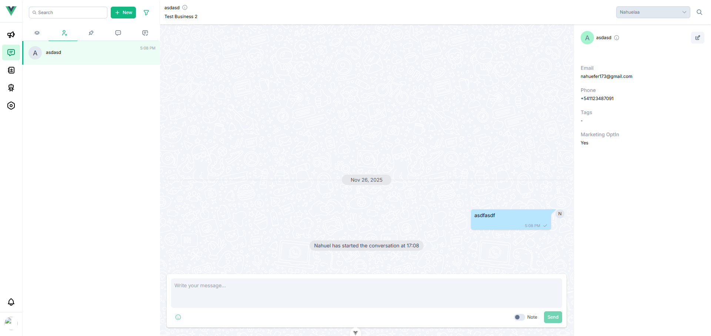

# Wizzova

WhatsApp Business API marketing platform for automated conversations, broadcasting, and customer engagement.



## Features

- Visual bot flow designer for automated conversations
- Broadcast campaigns with scheduling and analytics
- Real-time chat interface with WebSocket support
- Contact management with custom fields and groups
- WhatsApp template builder and management
- Multi-tenant architecture for business isolation
- Dual payment provider support (Stripe and MercadoPago)

## Tech Stack

- Frontend: Vue 3, TypeScript, PrimeVue, Tailwind CSS
- Backend: Laravel 12, MySQL, Redis
- Real-time: Pusher WebSockets
- Queue: Laravel Horizon

## Getting Started

### Prerequisites

- Node.js 20+
- PHP 8.2+
- MySQL/PostgreSQL
- Redis

### Installation

Clone the repository and install dependencies:

```bash
# Frontend setup
npm install
npm run dev
```

The backend API (wizzova-api) needs to be set up separately:

```bash
cd ../wizzova-api
composer install
php artisan migrate
composer dev
```

### Environment Variables

Create a `.env` file with:

```
VITE_API_URL=http://localhost:8000
```

## Development

```bash
npm run dev          # Start development server
npm run build        # Production build
npm run type-check   # TypeScript validation
npm run lint         # Lint and fix
npm run format       # Format code
```

## License

Proprietary
